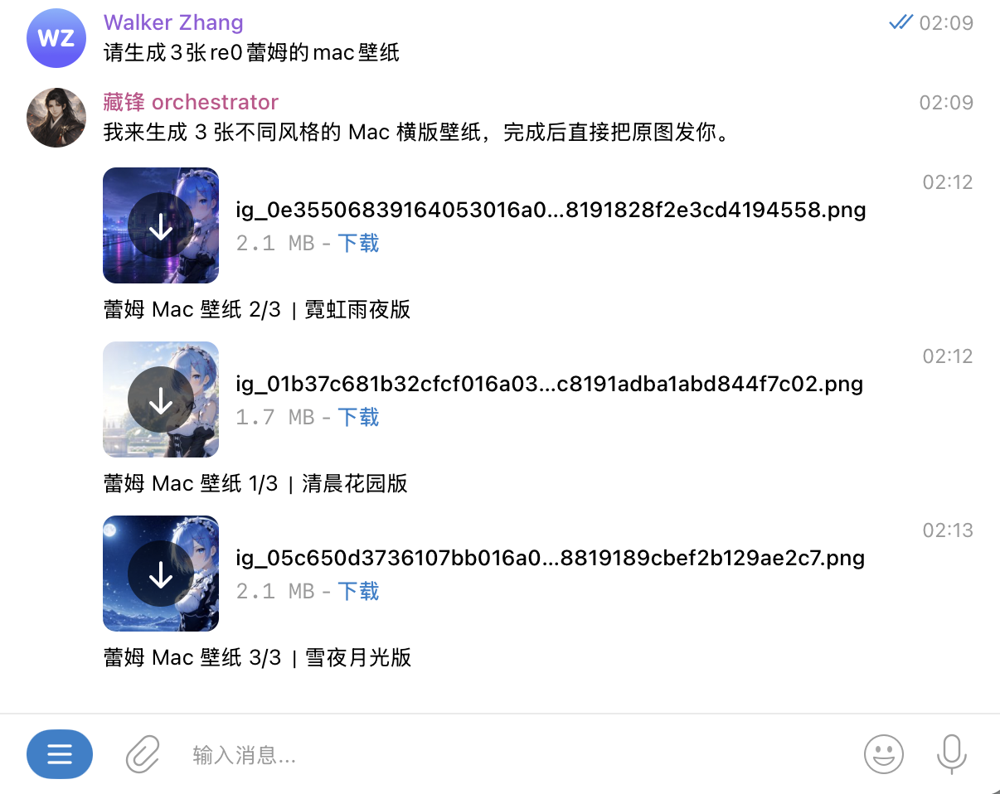

[English](./README.md)

# codex-imgen

`codex-imgen` 是一个本地优先的 Go CLI 和异步任务服务，用来把 Codex CLI 内置的 `$imagegen` 能力变成可脚本化、可排队、可查询、可集成的图像生成工作流。

`codex-imgen` 是独立社区工具，不隶属于 OpenAI，也不是 OpenAI 官方项目。

## 为什么用 codex-imgen？

Codex CLI 本身已经有图像生成能力。`codex-imgen` 关注的是它外面的工程化工作流：

- 用简单的本地 CLI 执行文生图和图生图
- 通过重复 `--image` 使用本机参考图
- 用 `submit`、`status`、`get`、`list`、`cancel` 提交和查询异步任务
- 用 `--count` 和 `--concurrency` 控制候选数量与并发
- 通过按任务订阅的 WebSocket 事件接入本地工具和 agent
- 提供 OpenClaw/TG 原图投递集成检查和 skill 同步护栏
- 结构化配置放在 `configs/config.yaml`，敏感信息放在 `.env`

如果只需要偶尔生成一张图，直接用原生 `codex exec` 就够了。如果需要可重复生成、批量候选、任务追踪或本地集成，可以使用 `codex-imgen`。

## 能力对比

| 需求 | 原生 `codex exec` | `codex-imgen` |
|---|---:|---:|
| 一次性 prompt | 支持 | 支持 |
| 简洁 CLI 体验 | 有限 | 支持 |
| 本机参考图 | 手动处理 | 支持 |
| 候选数量/并发控制 | 手动处理 | 支持 |
| 异步任务队列 | 不支持 | 支持 |
| status/list/cancel | 不支持 | 支持 |
| WebSocket 事件 | 不支持 | 支持 |
| agent/service 集成 | 手动处理 | 支持 |
| 本地 YAML 配置 | 不支持 | 支持 |

## 演示

OpenClaw/TG 投递可以把生成图片作为原图文件发送，并为每个结果保留 caption。



## 安装

#### 方式一：下载 Release 归档

从 [GitHub Releases](https://github.com/walker1211/codex-imgen/releases) 下载对应 OS/arch 的归档，然后解压：

```bash
tar -xzf codex-imgen_<tag>_<os>_<arch>.tar.gz
cd codex-imgen_<tag>_<os>_<arch>
cp configs/config.example.yaml configs/config.yaml
# 可选：仅在启用邮件 secret 时需要
cp .example.env .env
./imgen --help
```

Windows 下运行 `imgen.exe --help`。

Release 归档包含 `imgen`、`skill-sync` 二进制，`configs/config.example.yaml`、`.example.env`、README 文件和 `LICENSE`。

#### 方式二：从源码构建

需要 Go 环境，以及已登录可用的 Codex CLI。

```bash
git clone https://github.com/walker1211/codex-imgen.git
cd codex-imgen
cp configs/config.example.yaml configs/config.yaml
# 可选：仅在启用邮件 secret 时需要
cp .example.env .env
bash ./build.sh
./imgen --help
```

上面的源码构建命令默认使用类 Unix shell；Windows 下构建出的二进制名为 `imgen.exe` 和 `skill-sync.exe`。

在使用服务模式、自定义 backend 或邮件通知前，请先填写 `configs/config.yaml`。SMTP 授权码等敏感信息只放 `.env`。

说明：程序默认从当前工作目录读取 `configs/config.yaml`。即使把二进制加入 `PATH`，也仍然需要在包含 `configs/config.yaml` 的工作目录中运行。

## Skill 同步

`.claude/skills/imgen/` 是 skill 源文件；`.openclaw/skills/imgen/` 是仓库内 OpenClaw 镜像；`~/.claude/skills/imgen/`、`~/.openclaw/workspace/skills/imgen/` 与 `~/.codex/skills/imgen/` 是本机安装产物。

检查本机安装是否与仓库源文件一致：

```bash
go run ./cmd/skill-sync --check
```

把仓库源文件同步到本机 Claude、OpenClaw 和 Codex，并更新仓库内 OpenClaw 镜像：

```bash
go run ./cmd/skill-sync --apply
```

也可以先运行 `bash ./build.sh`，再使用本地二进制：

```bash
./skill-sync --check
./skill-sync --apply
```

默认只检查漂移；只有显式传入 `--apply` 时才会覆盖本机 skill 安装目录。

## OpenClaw doctor

检查本机 OpenClaw 是否满足 imgen / Telegram 原图发送集成要求：

```bash
./imgen doctor openclaw
```

该命令只读检查 `image_generate` deny、main agent 的 `message` 暴露、Telegram direct `NO_REPLY` 静默、OpenClaw `message send --force-document` 支持、OpenClaw imgen skill 安装与同步状态、`IMGEN_DELIVERY_DIR` / `forceDocument` / `asDocument` 调用契约、同步 CLI JSON 成功判定契约，以及本地 `backend.delivery_dir` 是否位于 OpenClaw 可发送根目录。WARN 行不阻断；FAIL 行表示需要修复配置、OpenClaw CLI 能力或 skill 同步。

## 配置

仓库内配置布局：

- `configs/config.example.yaml`：结构化配置模板，提交到版本库
- `configs/config.yaml`：本地真实结构化配置，不提交到版本库
- `.example.env`：敏感信息模板，提交到版本库
- `.env`：本地真实敏感信息，不提交到版本库

原则：

- `.env` 只放敏感值。
- YAML 只放结构化配置。
- `EMAIL_SMTP_AUTH_CODE` 是邮件 SMTP 授权码，供邮件发送使用。

初始化方式：

```bash
cp configs/config.example.yaml configs/config.yaml
cp .example.env .env
```

然后按需编辑 `configs/config.yaml`：

```yaml
server:
  listen: 127.0.0.1:18080 # 服务监听地址；默认仅允许本机访问
  read_timeout: 5s # HTTP 读取请求超时
  write_timeout: 30s # HTTP 写响应超时

storage:
  data_dir: "" # 服务数据目录；为空时使用系统用户数据目录
  sqlite_path: "" # SQLite 数据库路径；为空时使用 data_dir/imgen.db

scheduler:
  global_max_concurrency: 10 # serve 内底层生图队列总并发；submit async 和 WebSocket realtime 共用
  default_job_concurrency: 2 # submit async 单个 job 默认同时生成几张图
  max_job_concurrency: 10 # submit async 单个 job 允许的最大生成并发
  max_count_per_job: 10 # submit async 单个 job 最多生成多少张图
  maintenance_interval: 5m # 后台维护任务执行间隔
  task_lease_timeout: 30m # 后台任务租约超时时间
  max_attempts: 3 # submit async 单张图片失败后的最大重试次数

backend:
  type: built_in_codex # 使用本机 Codex CLI 调用内置 $imagegen
  command: codex # Codex CLI 命令名或可执行文件路径
  model: "" # 为空时使用 Codex CLI 默认模型；需要固定模型时再填写
  cwd: "" # Codex CLI 工作目录；为空时使用当前进程工作目录
  timeout: 90s # 单次 Codex/imagegen 调用超时时间
  delivery_dir: "" # 可选：生成后复制图片到该目录；OpenClaw/TG 可指向其允许发送的 workspace/media 目录
  delivery_max_files: 200 # delivery_dir 非空时最多保留的投递文件数；0 表示不自动清理
  cleanup_source_thread_dir: false # delivery_dir 非空且复制成功后，是否删除 Codex generated_images 中本次图片所在的 thread 目录
  prompt:
    prefix: "$imagegen" # 自动加到 prompt 前面的前缀
    prelude: | # 固定提示词说明，用于统一默认风格和输出约束
      使用内置 imagegen 技能。
      输出单张图片。
      默认适合网页或品牌资产场景。

realtime:
  enabled: true # 是否启用 WebSocket realtime 生图接口
  max_sessions: 4 # 同时最多允许多少个活跃 WebSocket 生图 session
  max_items_per_session: 8 # 单个 WebSocket generate.start 最多包含多少个 item
  max_count_per_item: 1 # 单个 realtime item 最多生成多少张图
  item_timeout: 300s # 单个 realtime item 默认生成超时
  max_item_timeout: 300s # 客户端 timeout_ms 允许的最大值；通常与 item_timeout 保持一致

email:
  enabled: false # 是否启用维护失败邮件通知
  smtp_host: smtp.example.com # SMTP 服务器地址
  smtp_port: 465 # SMTP 端口；465 使用隐式 TLS
  from: from@example.com # 发件人邮箱，也是 SMTP 登录账号
  to: to@example.com # 收件人邮箱
  timeout: 3s # 单次 SMTP 连接和发送超时
  retry_times: 3 # 邮件发送最大尝试次数
  retry_wait_time: 500ms # 邮件发送失败后的重试间隔
  use_proxy: false # SMTP 发送暂不支持代理；保持 false
```

参数说明：

- `server.listen`：服务模式监听地址。`127.0.0.1:18080` 只允许本机访问；如需局域网访问可改为 `0.0.0.0:18080`。
- `server.read_timeout`：HTTP 读取请求超时。
- `server.write_timeout`：HTTP 写响应超时。
- `storage.data_dir`：异步服务数据目录；为空时使用用户目录下的默认数据路径。本地开发可设为 `./.data`。
- `storage.sqlite_path`：SQLite 数据库路径；为空时使用 `data_dir/imgen.db`。本地开发可设为 `./.data/imgen.db`。
- `scheduler.global_max_concurrency`：`imgen serve` 内底层生图队列的总并发上限，`submit` 异步任务和 WebSocket realtime 共用；不影响本地同步简写 `imgen "提示词"`。
- `scheduler.default_job_concurrency`：异步 `submit` job 没显式传 `--concurrency` 时的默认并发。
- `scheduler.max_job_concurrency`：异步 `submit` job 允许的最大并发。
- `scheduler.max_count_per_job`：单个异步任务允许生成的最大图片数量；用户传入更大 `--count` 会被限制到该上限。
- `scheduler.maintenance_interval`：服务模式维护任务执行间隔，用于巡检、失败状态推进和失败通知。
- `scheduler.task_lease_timeout`：运行中任务租约超时时间，用于判断任务是否过期。
- `scheduler.max_attempts`：异步任务每张图片最多生成尝试次数。
- `realtime.enabled`：是否启用 WebSocket realtime 生图接口。
- `realtime.max_sessions`：同时最多允许多少个活跃 WebSocket 生图 session。
- `realtime.max_items_per_session`：单个 WebSocket `generate.start` 最多包含多少个 item。
- `realtime.max_count_per_item`：单个 realtime item 最多生成多少张图。
- `realtime.item_timeout`：单个 realtime item 默认生成超时；realtime 不再有独立 backend 全局队列。
- `realtime.max_item_timeout`：客户端 `timeout_ms` 允许的最大值；通常与 `item_timeout` 保持一致即可。
- `backend.type`：生成后端类型；当前使用 `built_in_codex`。
- `backend.command`：Codex CLI 命令，默认 `codex`；当前内置 backend 要求该命令支持 `exec --json`。
- `backend.model`：传给 Codex CLI 的模型名；为空时由配置的 Codex backend 使用默认模型。
- `backend.cwd`：Codex CLI 执行工作目录；为空时使用当前进程工作目录，支持 `~/` 展开。
- `backend.timeout`：单次 Codex/imagegen 调用超时；生成经常超时时可适当调大。
- `backend.delivery_dir`：可选投递目录；配置后生成图片会先复制到该目录，再返回复制后的路径。OpenClaw/TG 可指向其允许发送的 workspace/media 目录。
- `backend.delivery_max_files`：`delivery_dir` 非空时最多保留的投递文件数，默认 `200`；设为 `0` 可关闭自动清理。
- `backend.cleanup_source_thread_dir`：默认 `false`；设为 `true` 后，仅在 `delivery_dir` 非空且复制成功时删除本次图片所在的 Codex `generated_images/<thread-id>` 原始目录。
- `backend.prompt.prefix`：自动加到提示词前面的前缀，通常保持 `$imagegen`。
- `backend.prompt.prelude`：固定提示词说明，用于统一默认风格和输出约束。
- `email.enabled`：是否启用维护失败邮件通知。
- `email.smtp_host`：SMTP 服务器地址。
- `email.smtp_port`：SMTP 端口；`465` 使用隐式 TLS，其他端口使用带超时控制的标准 SMTP 连接。
- `email.from`：发件人邮箱，同时作为 SMTP 登录账号。
- `email.to`：收件人邮箱。
- `email.timeout`：单次 SMTP 连接和发送超时。
- `email.retry_times`：邮件发送最大尝试次数。
- `email.retry_wait_time`：邮件发送失败后的重试间隔。
- `email.use_proxy`：邮件代理开关；当前 SMTP 发送暂不支持代理，设为 `true` 会返回配置错误。
- `.env` 中的 `EMAIL_SMTP_AUTH_CODE`：SMTP 授权码或密码；启用邮件时必填。

## 同步文生图

```bash
./imgen "生成一张 3D 风格的小龙吉祥物，适合网页 hero 区域，背景干净，单图"
./imgen --count 4 --concurrency 2 "五更琉璃，穿着女仆装在咖啡馆"
./imgen --count 4 --concurrency 2 --json "五更琉璃，穿着女仆装在咖啡馆"
```

默认 text 模式会一行输出一个图片路径；`--json` 会输出结构化结果。自动化调用应以 `ok: true` 且 `images[].path` 非空作为成功标准，不要只看退出码。

## 同步图生图

使用本机图片路径作为参考图：

```bash
./imgen --image ./1.png "保留主体构图和姿态，把这张图改成高质量 3D 手办渲染风格，背景更干净，单图"
./imgen --json --image ./1.png "保留主体构图和姿态，把这张图改成高质量 3D 手办渲染风格，背景更干净，单图"
```

多张参考图可以重复 `--image`：

```bash
./imgen --image ./1.png --image ./2.png "参考这些图片的主体特征，生成一张统一风格的高质量视觉图，单图"
```

说明：

- 当前只支持本机文件路径，不支持 URL 或上传文件。
- 同步 `run` 与异步 `submit` 的 `--image` 参数语义一致。
- backend 调用 Codex CLI 时会生成 `<backend.command> exec --json --image ... -- '<prompt>'`。
- `--` 分隔符对原生 Codex CLI 是必需的，否则 variadic `--image` 会吞掉 prompt。
- `ccs codex` 等包装命令不一定兼容；如果 `ccs codex exec --json` 报 `unknown option '--json'`，当前内置 backend 不能直接使用它。

直接使用 Codex CLI 验证底层能力时，先确认可执行文件支持 `exec --json`：

```bash
codex exec --help
codex exec --json -- '$imagegen 生成一张 Q 版小龙吉祥物，白底，单图'
codex exec --json --image ./1.png -- '$imagegen 保留主体构图和姿态，把这张图改成高质量 3D 手办渲染风格，背景更干净，单图'
```

## Agent / OpenClaw / Telegram 集成

本项目只负责生成图片并返回本机文件路径；Telegram、OpenClaw 或其他 agent 需要读取 `images[].path` 指向的文件并上传文件本体，不能把本机路径当作图片 URL 或远端 file id。

集成方应遵守这个最小契约：

1. 在调用前定位配置工作目录：优先使用 `IMGEN_REPO_ROOT`；否则从当前目录向上查找包含 `configs/config.yaml` 且包含 `./imgen`、`build.sh` 或 `go.mod` 的目录；再尝试用户明确提供的安装路径。不要扫描整个文件系统。
2. 从该目录运行 `./imgen --json ...`，或服务模式下运行 `./imgen get --json <job-id>`。
3. OpenClaw/TG 场景建议通过 `IMGEN_DELIVERY_DIR` 或 `backend.delivery_dir` 把图片复制到 OpenClaw 可发送的 workspace/media 目录，并用 `delivery_max_files` 控制投递目录最多保留的文件数；需要清理 Codex 原始 thread 目录时再显式开启 `cleanup_source_thread_dir`。
4. 同步生成成功必须满足 `ok: true` 且期望数量的 `images[].path` 非空；服务任务完成后从 `images[].path` 读取最终文件。
5. 如果 Telegram 返回类似 `Media failed`，优先在 Telegram/OpenClaw 所在环境检查 `images[].path` 是否存在、可读、格式有效，并确认两边共享同一文件系统或已复制文件。

对于需要不同主题的 Telegram 多图请求，OpenClaw 应并发运行多条独立的 `./imgen --json --count 1 --concurrency 1` 命令，每条完成后立刻用 `message` 工具发送对应的 `images[].path`，PNG 原图发送应使用 `forceDocument` 或 `asDocument`，直接发完文件后最终只返回 `NO_REPLY`。

### OpenClaw + Telegram 快速接入

1. 运行 `./skill-sync --apply` 同步 imgen skill，然后重启 OpenClaw。
2. 运行 `./imgen doctor openclaw`，确认 `message send supports --force-document` 为 OK，且没有 FAIL。
3. 在 Telegram 里发一条测试消息，例如：`请生成 3 张不同氛围的猫咪 Mac 壁纸`。
4. 期望收到 3 个图片文件/文档；可以有简短说明和 caption，但不应该看到字面量 `NO_REPLY`。

`NO_REPLY` 是给 OpenClaw 的静默结束信号：图片已经直接发到 Telegram 后，agent 不再追加一条最终文字回复。

完整 OpenClaw 复刻与配置检查清单见 [OpenClaw imgen 集成](./docs/openclaw-imgen-integration.zh-CN.md)。

## 服务模式

可以直接前台启动本地服务：

```bash
./imgen serve
```

也可以使用仓库内脚本在后台运行服务：

```bash
./start.sh
./stop.sh
./restart.sh
```

后台脚本使用 `nohup ./imgen serve`，日志写入 `logs/out.log`。

再在另一个终端提交和查询：

```bash
./imgen submit --count 4 --concurrency 2 "五更琉璃，穿着女仆装在咖啡馆"
./imgen submit --json --count 4 --concurrency 2 "五更琉璃，穿着女仆装在咖啡馆"
./imgen submit --image ./1.png "保留主体构图和姿态，把这张图改成高质量 3D 手办渲染风格，背景更干净，单图"
./imgen status <job-id>
./imgen get <job-id>
./imgen get --json <job-id>
./imgen list
./imgen cancel <job-id>
```

如需排查某个任务是否发生重试，可以查看 SQLite 中的 attempt 明细：

```bash
sqlite3 .data/imgen.db \
  "select job_id,image_index,attempt,status,duration_ms,path,last_error from job_image_attempts where job_id='<job-id>' order by image_index,attempt;"
```

如需进一步判断单次 Codex CLI 调用慢在哪个阶段，可以查看 phase 明细：

```bash
sqlite3 .data/imgen.db \
  "select image_index,attempt,phase,elapsed_ms,detail from job_image_attempt_phases where job_id='<job-id>' order by image_index,attempt,occurred_at_ms;"
```

常见判断方式：

- `process.started` 很晚：启动 Codex CLI 或系统调度慢。
- `stdout.thread_started` 很晚：Codex CLI 初始化、网络或会话创建慢。
- `stdout.turn_started` 到 `image.file_detected` 很久：主要耗时在图片生成或落盘等待。
- `image.file_detected` 到 `stdout.turn_completed` 很久：图片文件已出现，但 Codex turn 还在完成最终响应或内部收尾。
- `stdout.turn_completed` 到 `process.exited` 很久：Codex turn 已完成，但 CLI 进程退出较慢。
- 如果没有 `stdout.turn_completed`，`image.file_detected` 到 `process.exited` 很久：图片文件已出现，但 Codex CLI 收尾退出较慢。
- 如果没有 `image.file_detected`，`stdout.turn_started` 到 `stdout.saved_to` / `process.exited` 很久：主要耗时仍在模型或 imagegen 工具执行链路。
- `process.exited` 到 `parser.completed` 很久：本地解析或 generated_images 目录查找慢。

## WebSocket

服务暴露 `/ws?job_id=<job-id>`，支持按 job 订阅事件。当前支持的事件包括：

- `job.created`
- `job.started`
- `image.started`
- `image.completed`
- `image.failed`
- `image.cancelled`
- `job.completed`
- `job.partial_success`
- `job.failed`
- `job.cancelled`

当前 WebSocket 能力仍偏最小：已有连接升级、按 `job_id` 订阅和事件推送；历史回放与断线恢复后续再完善。

## 输出

- 默认 text 模式一行输出一个图片路径。
- `--json` 输出结构化结果，自动化调用应读取 `images[].path`。
- 多图同步模式下一行一个路径。
- 服务模式通过 `job_id` 查询状态与图片路径。
- maintenance ticker 已接入 `serve`，会做最小巡检、失败状态推进和最终失败通知。
- 失败邮件通知已接入 maintenance 路径；更精细的失败分类与即时通知后续再完善。

## 开发 / 测试

```bash
go test ./...
bash ./build.sh
```

如修改了命令行参数、配置加载或 README，建议同时验证：

```bash
./imgen --help
./imgen --json "生成一张 Q 版小龙吉祥物，白底，单图"
```
